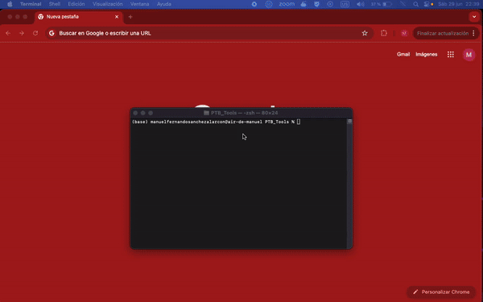

# PTB-Tools

Implementation of all MRI image analysis tools used by the Physikalisch-Technische Bundesanstalt (PTB).

## Table of Contents

- [About the Project](#about-the-project)
- [Getting Started](#getting-started)
  - [Installation](#installation)
- [Usage](#usage)
- [Contributing](#contributing)
- [License](#license)
- [Contact](#contact)
- [Acknowledgments](#acknowledgments)

## About the Project

This project features a graphical user interface built with HTML, CSS, and JavaScript to execute image analysis and processing algorithms specifically designed for magnetic resonance imaging (MRI). These algorithms are typically used by division 8.14 (Ultrahigh Field MRI) of the Physikalisch-Technische Bundesanstalt (PTB).

The Python codes used in this project implement tools for obtaining B1+ maps from CV/GRE or AFI images, selecting regions of interest (ROI) in the B1+ maps, executing B1 shimming algorithms, and designing kT-points pulses.



## Getting Started

To get a local copy up and running, follow these simple steps.

### Installation

Step-by-step guide on how to get the development environment running.

1. Clone the repo:
   ```sh
   git clone https://github.com/your_username/repo_name.git
   ```
2. Navigate to the project directory:
   ```sh
   cd PTB-Tools-main
   ```
3. Install dependencies:
   ```sh
   pip3 install -r requirements.txt
   ```

## Usage

To use this project, follow the instructions below.

1. Change the access permissions to the main bash script
   ```sh
   chmod u+x execute_app.sh
   ```
2. Execute the main bash file
   ```sh
   ./execute_app.sh
   ```

## Contributing

Contributions are what make the open source community such an amazing place to learn, inspire, and create. Any contributions you make are **greatly appreciated**. If you have a suggestion for improving this project, please fork the repository and create a pull request. You can also open an issue with the tag "enhancement". Don't forget to give the project a star! Thank you!

1. Fork the Project.
2. Create your Feature Branch (\`git checkout -b feature/AmazingFeature\`).
3. Commit your Changes (\`git commit -m 'Add some AmazingFeature'\`).
4. Push to the Branch (\`git push origin feature/AmazingFeature\`).
5. Open a Pull Request.

## License

Distributed under the MIT License. See [MIT License](https://github.com/Spoksonat/PTB-Tools/blob/main/LICENCE.txt) for more information.

## Contact

Manuel Fernando Sánchez Alarcón - manuel.alarcon@ptb.de - manuel-fernando-sanchez-alarcon@charite.de - mf.sanchez17@uniandes.edu.co

Project Link: [PTB-Tools](https://github.com/Spoksonat/PTB-Tools)

## Acknowledgments

- [Christoph Aigner](https://github.com/chaigner)
